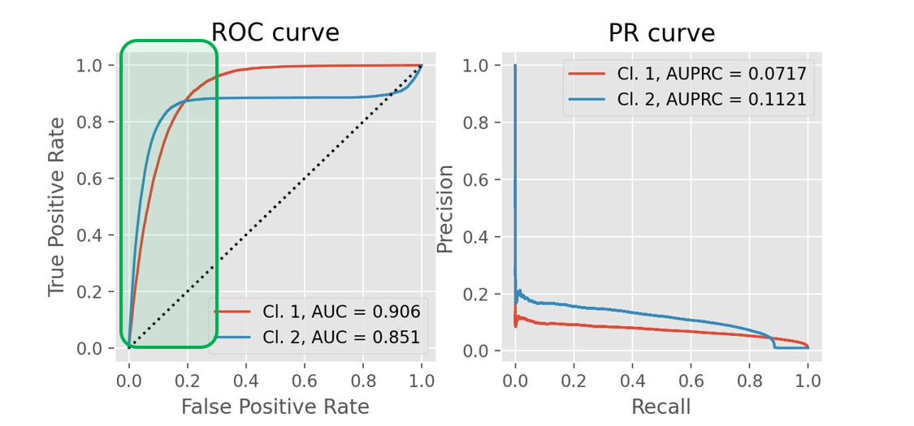
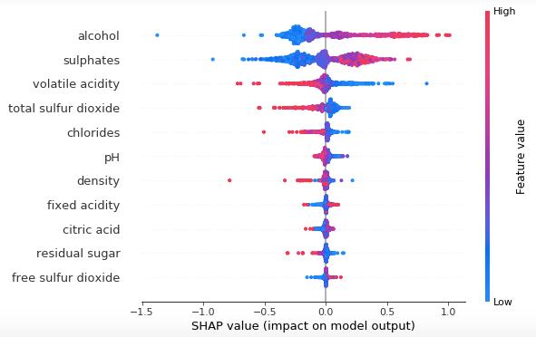
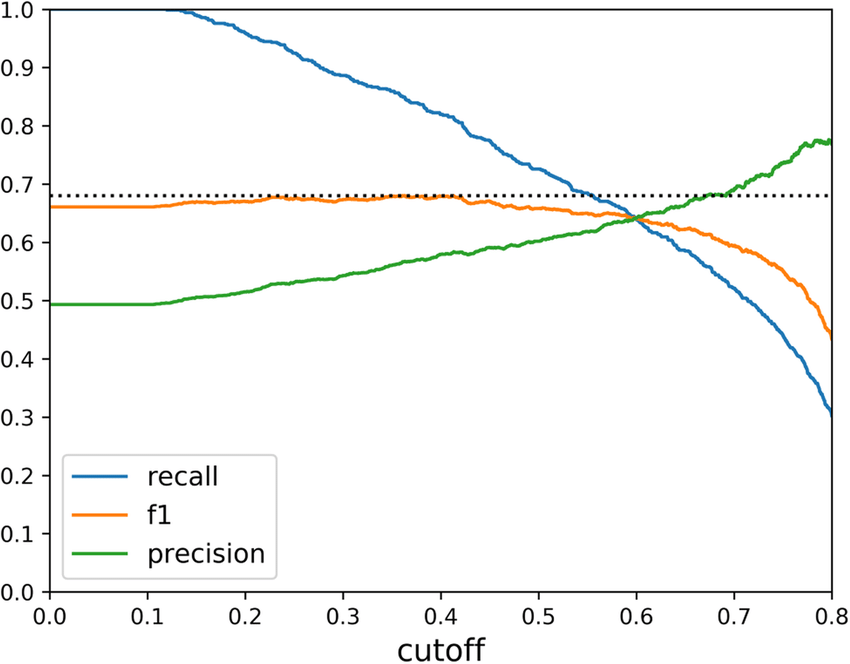

# API Security: Anomaly Detection App

> [!WARNING]
> All the metrics, plots, and insights are made up and taken from the internet


## Dataset

The dataset for this project can be found on [Kaggle](https://www.kaggle.com/datasets/tangodelta/api-access-behaviour-anomaly-dataset/data) (licensed under GPL-2).

Distributed micro-services based applications are typically accessed via APIs. The authors of this dataset have collected sequences of API calls from an application and put them into a graph format. For this graph, they've generated common API access patterns (i.e. sequences of API calls) and have calculated user access metrics that can be used to classify these behaviours. Also, they've manually labelled a set of these behaviour patters (our training set) and have provided the remaining sequences for us to classify.

## Objectives

The main objective of this project is:

> **To develop a system that will be able to detect anomalous behaviour from the API calls for the remaining sequences**

To achieve this objective, it was further broken down into the following 5 technical sub-objectives:

1. To perform in-depth exploratory data analysis of the both datasets (tabular and graph)
2. To engineer new predictive features from the available graphs
3. To develop a supervised model to classify behaviour into normal and anomalous
4. To recommend a threshold that will perform better than the present baseline (ALGO-X) in terms of F1 score
5. To create an API endpoint for the trained model and deploy it

## Main Insights

From the exploratory data analysis, we found out that anomalous behavviour patterns are cahracterised by:

* Insight about anomaly vs normal #1
* Insight about anomaly vs normal #2
* Insight about anomaly vs normal #3

## Engineered Features

From the provided networks, the following features were extracted:

* Feature 1 - this feature helps us to measure *X* activity and is expected to be much higher in anomalies/normal behaviour
* Feature 2 - this feature helps us to measure *X* activity and is expected to be much higher in anomalies/normal behaviour
* Feature 3 - this feature helps us to measure *X* activity and is expected to be much higher in anomalies/normal behaviour

As a result of this feature engineering work, the ROC AUC for the final model has increased by 30% and has improved F1 score uplift from the baseline model from 1.5 to 1.8.

## Model Selection

Models were compared between each other using ROC AUC since we're dealing with binary classification task and the label distribution is relatively balanced.
2 models (XGBoost and LightGBM) were tuned for 50 iterations. The best performing model is LightGBM with the following parameters:

```json
{
    colsample_by_tree: 0.2,
    num_trees: 2454,
    learning_rate: 0.02,
    subsample: 0.5
}
```



LightGBM has outperformed XGBoost by *X%* in terms of ROC AUC. From the PR AUC curves, we can also see that it can give use gigher level of recall with the same precision at most of the thresholds, so this model is selected for deployment.

### Model Explainability



The selected model has a well balanced feature improtance distribution, with top 3 features being *X, Y, and ~*. The directions of SHAP values are intuitive, since we expect that anomalies have larger rate of *X* and *Y* and smaller number of *Z*
Notably, the engineered features are also considered to be important (4th, 5th and 7th place), which means that the feature engineering effort was successful.

## Business Metrics

To determine the achieved business metrics, we first need to set the threshold for our classifier.



From the threshold analysis, we can see that the maximum F1 score we can achieve is *X* across a variety of thresholds. For the purpose of this project, we can assume that the business is more interested in obtaining higher recall than precision, so we'll set the threshold at *X* which gives us the following metrics *(numbers are made up)*:

| Threshold  | 0.25 |
|------------|------|
| Precision  | 0.7  |
| Recall     | 0.9  |
| F1 Score   | 0.85 |
| Alert Rate | 0.02 |

## Prediction Service

For this project, the assumtpion is that feature engineering will be handled by another serivce, so the deployment part is responsible purely for the model inference.
To create the API locally, you'll need to use Docker.

### Step 1: Build Docker Image

Clone the repository and go to the folder with the Dockerfile. Then run the following command to build the image.

```shell
docker build -t prediction-service:latest .
```

To check if the image was created successfully, run `docker images` in you CLI and you should see `prediction-service` listed.

### Step 2: Send the Request

To test if the API is working, you can run the `ping.py` file in the `app` folder. You'll need Python installed on your computer.

```shell
python app/ping.py
```

### Step 3: Measuring Response Time

The following response times were measured locally by sending 100 requests per second from 1 user:

| Response Time                 | Measure      |
|-------------------------------|--------------|
| Median Response Time          | 0.1 seconds  |
| 99th Percentile Response Time | 0.9 seconds  |
| Max Response Time             | 0.95 seconds |

To run these tests on your machine, you'll need to run the `measure_response.py` script

```shell
python app/measure_response.py
```

## Authors

* [Antons Tocilins-Ruberts](https://github.com/aruberts)
